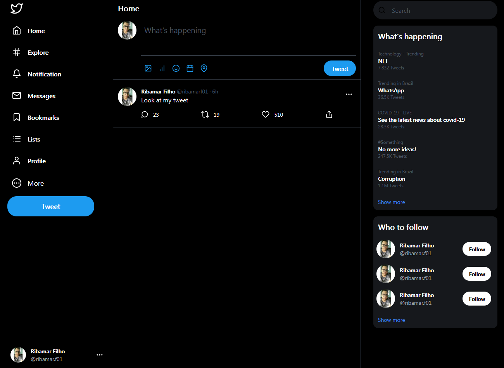

# Twitter clone with Tailwind!

## 👀 Project Overview

- 🥴 Too much twitter...
- 👨‍💻 TailwindCSS build for Twitter, cloning the feed page, where you see the tweets coming...
- 🔗 You can find this project live on: <i>Coming soon</i>.

## 🔥 Techs used

<div style="
    display: inline-block
">
    
    
</div>

## 🔧 Build Setup

```bash
# install dependencies
$ npm install

# serve with hot reload at localhost:3000
$ npm run dev

# build for production
$ npm run build

# project preview
$ npm run preview

You can also use yarn!
```

## 📷 Project images


(Lots of me...😳)
